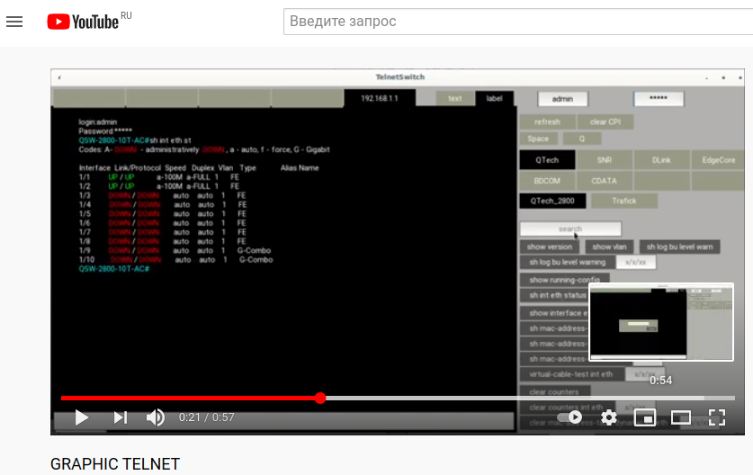
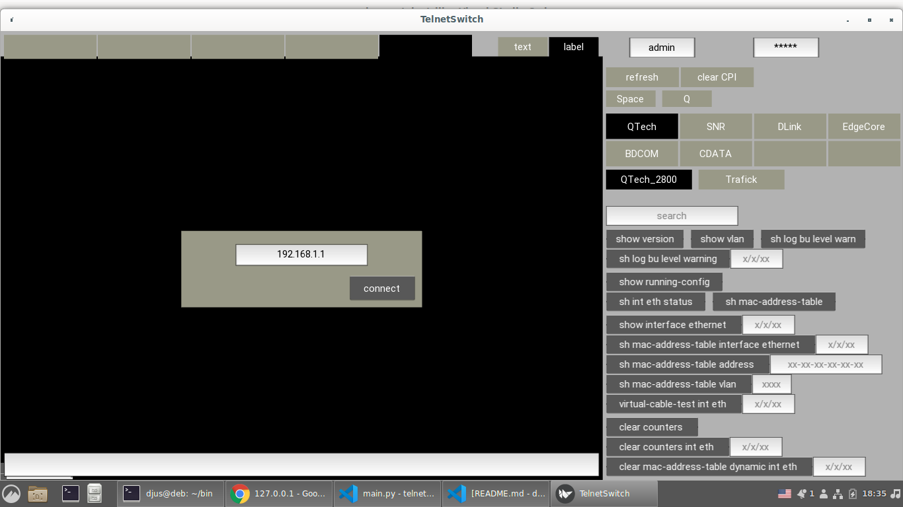
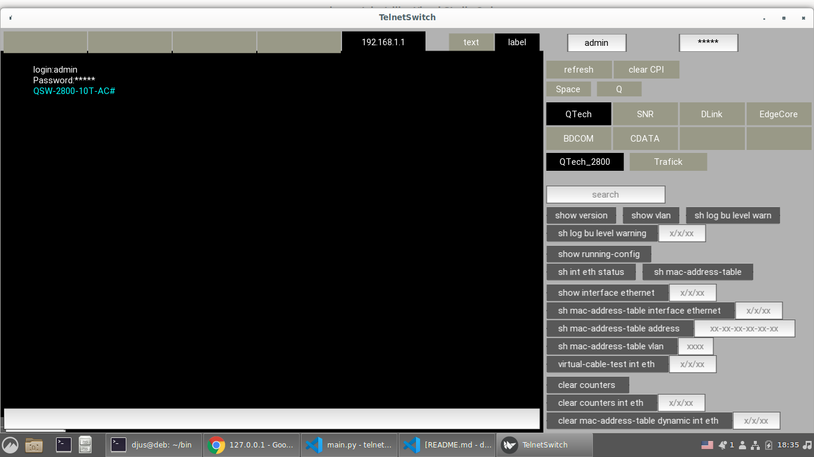
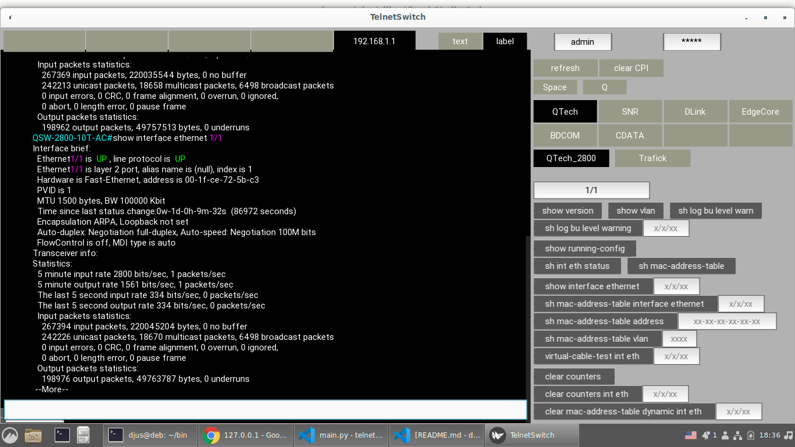
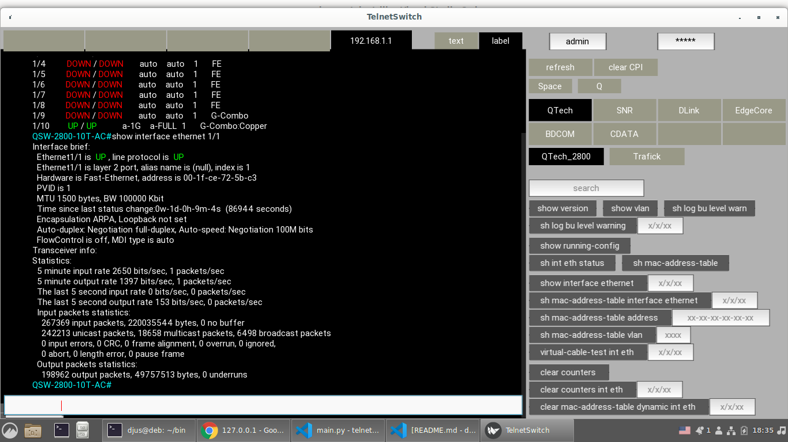
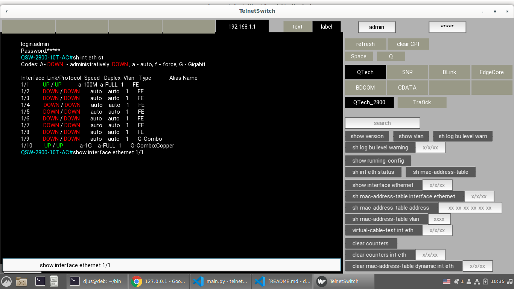
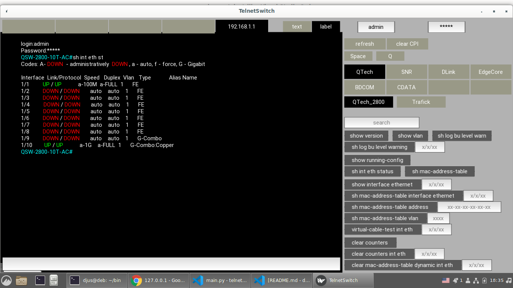

# GRAPHIC TELNET

## This application was created to speed up the work with Layer 2 switches. Built on the Kivy graphics framework. Allows you to work both through the command line in the application itself, which supports command completion, and using bindin buttons with commands and text search, with highlighting by color. Allows you to create up to 5 tabs with addresses (more possible)

### Used technologies:
* pipenv (virtual environment)
* python
* Kivy
* telnetlib

More details can be found in [Pipfile.lock](Pipfile.lock)

This is my second application using object oriented programming. Not finished. Ideally it would be to add dynamic button creation.Used at work.

### Video from YouTube with installing the application and using it.:

 
    

## screenshot of the application from the desktop version 

 
     </img>
    </img>
    </img>
    </img>
    </img>
    </img>

### The structure of the finished application 
.  
├── telnetswitch.kv  
├── telnet_connect.py  
├── README.md  
├── main.py  
├── eventdispatcher.py  
├── DeviceClass  
│   ├── SNR.py  
│   ├── QTech.py  
│   ├── EdgeCore.py  
│   ├── DLink.py  
│   ├── CDATA.py  
│   └── BDCOM.py  
└── data  
    └── f.png  

Refactoring in my spare time. 
